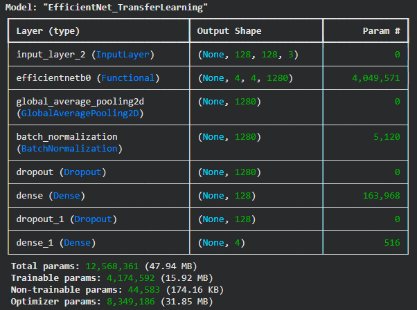
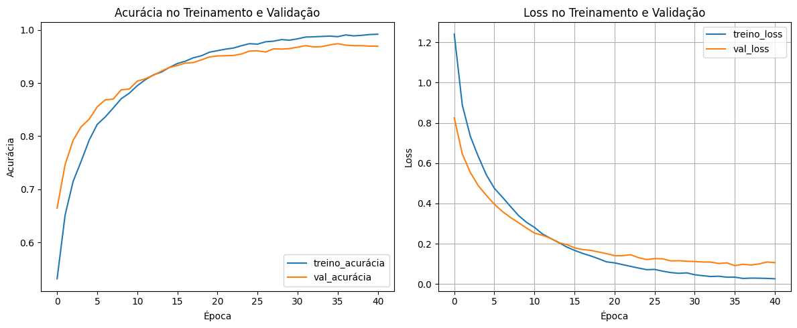
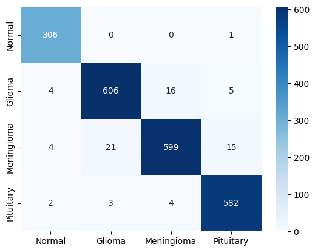

# Classificação de tumores cerebrais usando EfficientNet e XAI

Este repositório contém o código para um modelo de classificação de imagens baseado em Transfer Learning (utilizando a arquitetura EfficientNet) projetado para classificar imagens de ressonância magnética (RM) de cérebros. O projeto tem um foco central em Explainable AI (XAI), implementando técnicas avançadas para explicar visualmente as decisões do modelo e validar sua confiabilidade clínica.

## Dataset

O modelo foi treinado e avaliado utilizando o dataset "[Crystal Clean: Brain Tumors MRI Dataset](https://www.kaggle.com/datasets/mohammadhossein77/brain-tumors-dataset)" disponível no Kaggle. Este dataset contém imagens de RM cerebrais categorizadas em 4 classes:

*   Sem tumor
*   Glioma 
*   Meningioma
*   Pituitary

O dataset original foi dividido em conjuntos de treino, validação e teste utilizando a biblioteca scikit-learn, garantindo a estratificação das classes.

## Arquitetura e pré-processamento

O pipeline do modelo diferencia-se pelo uso de segmentação robusta antes da classificação:

1. Pré-processamento (Segmentação): Implementação do algoritmo Otsu's Thresholding (via OpenCV) para remover o fundo e o crânio, isolando a região de interesse (ROI) do cérebro. Isso garante que o modelo aprenda apenas com tecidos cerebrais, evitando vieses causados por ruídos de fundo.
2. Backbone (Transfer Learning): Utilização da rede EfficientNetB0 pré-treinada no ImageNet como extrator de características.
3. Camadas Superiores (Top Layers):
    *   Global Average Pooling para redução dimensional.
    *   Batch Normalization para estabilizar o treinamento.
    *   Dropout para regularização e prevenção de overfitting.
    *   Camada Dense de saída com ativação Softmax (4 classes).

A compilação do modelo utiliza a função de perda `categorical_crossentropy` e o otimizador Adam.

Configuração da rede:

## Explainable AI (XAI)

Para garantir a transparência do modelo "caixa-preta", foram implementadas duas técnicas de explicabilidade, ambas ajustadas para respeitar a segmentação do treinamento:

1.  Grad-CAM++ (Gradient-weighted Class Activation Mapping ++):
    *   Visualização de mapas de calor baseados nos gradientes de 1ª, 2ª e 3ª ordem da última camada convolucional.
    *   Permite identificar com precisão a região espacial que mais ativou os neurônios para a classe predita.
  
2.  LIME (Local Interpretable Model-agnostic Explanations):
    *   Geração de explicações locais através de perturbações na imagem e segmentação em superpixels.
    *   Configurado para exibir áreas de confirmação (que apoiam a decisão) e áreas de contradição.
    *   Integração robusta com a etapa de segmentação para evitar que o algoritmo considere o fundo preto como característica relevante.

3. SHAP (SHapley Additive exPlanations):
   * Utiliza a teoria dos jogos para atribuir a contribuição de cada pixel (ou bloco de pixels) para a probabilidade final de cada classe.
   * Auditoria de Viés: Foi fundamental para identificar o "Shortcut Learning", revelando que o modelo inicialmente focava no osso do crânio. 
   * Validação de Segmentação: Após a implementação do *Skull Stripping* via OpenCV (Contornos + Erosão), o SHAP confirmou que o modelo passou a focar exclusivamente na massa tumoral e tecidos adjacentes.

## Treinamento
1. O conjunto de dados passou pelo pipeline de segmentação antes de entrar na rede.
2. O modelo utilizou pesos pré-treinados (ImageNet) como ponto de partida (Fine-tuning).
3. O treinamento utilizou callbacks como Early Stopping (monitorando a perda de validação) e ReduceLROnPlateau para ajuste dinâmico da taxa de aprendizado.
4. O melhor modelo (baseado na val_loss) foi salvo automaticamente através do ModelCheckpoint.

## Resultados

O gráfico abaixo mostra a evolução da acurácia e da perda durante as épocas de treinamento e validação:

Abaixo, a matriz de confusão do modelo treinado, demonstrando o desempenho por classe:

Após o treinamento, o modelo apresentou os seguintes resultados no conjunto de teste:

*   **Loss no teste:** 0.1755
*   **Acurácia no teste:** 0.9654 (96.54%)
*   **Precisão no teste:** 0.9671 (96.71%)
*   **Recall no teste:** 0.9626 (96.26%)
*   **F1-score no teste:** 0.9653 (96.53%)

## Como Usar

1.  Clone este repositório.
2.  Instale as dependências necessárias:
`pip install tensorflow opencv-python matplotlib lime scikit-image`
4.  Faça o download ou importe o dataset "[Crystal Clean: Brain Tumors MRI Dataset](https://www.kaggle.com/datasets/mohammadhossein77/brain-tumors-dataset)" do Kaggle.
5.  Organize o dataset no formato padrão (pastas por classe).
6.  Execute o notebook (`TLSeg_128_6.ipynb`) de treinamento para gerar o arquivo `.keras`.
7.  Para gerar as explicações, utilize os scripts de XAI fornecidos (`gc_lime_shap.py`), que carregarão o modelo salvo e aplicarão a segmentação automática nas imagens de teste antes de gerar os mapas de calor (Grad-CAM++), superpixels (LIME) e atribuição de valores de importância por pixels (SHAP).
8.  O melhor modelo treinado será salvo no caminho configurado para posteriores inferências ou análises.
